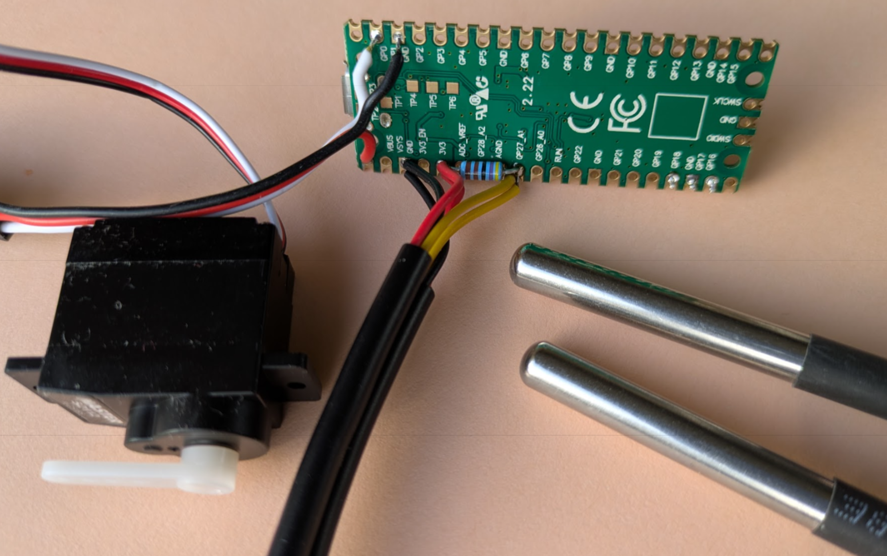
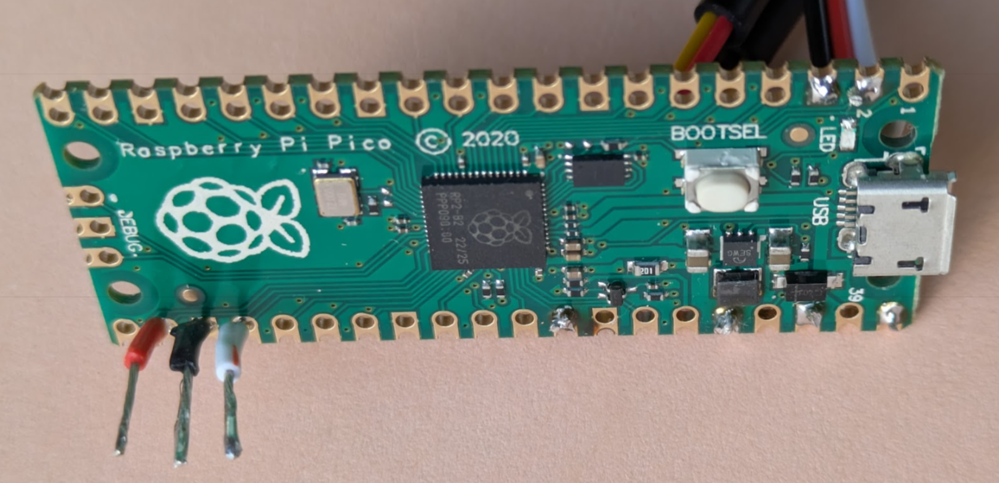

# demo_micropython

Code snippets to demonstrate Micropython

https://docs.micropython.org/en/latest/rp2/quickref.html#





## Cabling

### OneWire DS18B20

* GND(black): pin33
* DATA(yellow): pin32(GP27)
* 3V3(red): pin36
* DATA <-4k7-> 3V3

### Servo

* GND(black): pin3
* SIGNAL(white): pin2(GP1)
* 5V(red): pin40

### red and white button

* GND(black)
* DIP(red): pin22(GP17)
* DIP(white): pin24(GP18)

## Mpy-cross

**Basic bytecode compilation**

`uvx mpy-cross demo_1_onewire.py`

**Native code emission for RP2 (Raspberry Pi Pico)**

`uvx mpy-cross -march=armv6m -X emit=native demo_1_onewire.py`

**All optimizations for maximum performance**

`uvx mpy-cross -march=armv6m -X emit=native -X emit=viper -O3 demo_1_onewire.py`

## Extending MicroPython in C

https://docs.micropython.org/en/latest/develop/natmod.html#minimal-example

```C
// Helper function to compute factorial
static mp_int_t factorial_helper(mp_int_t x) {
    if (x == 0) {
        return 1;
    }
    return x * factorial_helper(x - 1);
}

// This is the function which will be called from Python, as factorial(x)
static mp_obj_t factorial(mp_obj_t x_obj) {
    // Extract the integer from the MicroPython input object
    mp_int_t x = mp_obj_get_int(x_obj);
    // Calculate the factorial
    mp_int_t result = factorial_helper(x);
    // Convert the result to a MicroPython integer object and return it
    return mp_obj_new_int(result);
}
```

Compile into `factorial.mpy`!

**Use**

```python
import factorial
print(factorial.factorial(10))
```
